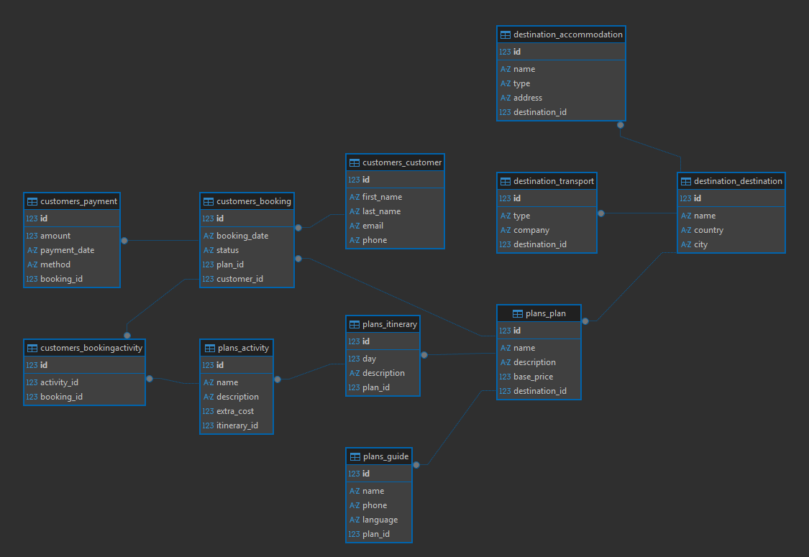

# SYSTEM DOCUMENTATION - AGENTURI TOURISM MANAGEMENT SYSTEM

## 1. Project Information

**Project Name:** AGENTURI - Tourism Agency Management System\
**Student Name:** \[To be completed\]\
**Course:** \[To be completed\]\
**Semester:** \[To be completed\]\
**Date:** November 2025\
**Instructor:** \[To be completed\]

**Short Project Description:**\
AGENTURI is a comprehensive full-stack web application designed for
tourism agency management. The system enables efficient administration
of customers, bookings, tourist destinations, travel plans, itineraries,
activities, tour guides, accommodations, and transportation services.
Built with Django REST Framework as backend and Angular with PrimeNG as
frontend, it provides a modern, scalable, and maintainable solution for
tourism business operations.

## 2. System Architecture Overview

### 2.1 Architecture Description

AGENTURI follows a **three-tier architecture** pattern:

1.  **Presentation Layer (Frontend):**

<!-- -->

    -   Angular 20.0.0 framework

    -   PrimeNG 20.3.0 UI component library

    -   Tailwind CSS 4.1.17 for styling

    -   Responsive single-page application (SPA)

2.  **Application Layer (Backend):**

    -   Django 5.2.7 framework

    -   Django REST Framework 3.15.2

    -   RESTful API architecture

    -   Business logic and data validation

3.  **Data Layer (Database):**

    -   Multi-database support: MySQL, PostgreSQL, MS SQL Server,
        Oracle, SQLite

    -   Configurable via environment variables

    -   ORM-based data access through Django models

**Architecture Pattern:** Client-Server with RESTful API communication

**Design Principles:**

-   Separation of concerns

-   DRY (Don't Repeat Yourself)

-   Modular component-based design

-   Stateless API communication

-   Reactive programming (RxJS observables)

### 2.2 Technologies Used

**Frontend:**

-   **Framework:** Angular 20.0.0

-   **UI Library:** PrimeNG 20.3.0, PrimeIcons 7.0.0

-   **Styling:** Tailwind CSS 4.1.17, \@primeuix/themes 1.2.5

-   **Language:** TypeScript 5.8.2

-   **HTTP Client:** Angular HttpClient

-   **State Management:** RxJS BehaviorSubjects

-   **Forms:** Reactive Forms

-   **Routing:** Angular Router

**Backend:**

-   **Framework:** Django 5.2.7

-   **API Framework:** Django REST Framework 3.15.2

-   **Language:** Python 3.x

-   **CORS Handling:** django-cors-headers 4.6.0

-   **Configuration Management:** python-decouple 3.8

**Database Engines Supported:**

-   MySQL (mysqlclient 2.2.7)

-   PostgreSQL (psycopg2-binary 2.9.11)

-   MS SQL Server (mssql-django 1.6, pyodbc 5.3.0)

-   Oracle (cx_Oracle 8.3.0 - commented out)

-   SQLite 3 (built-in)

**Additional Tools:**

-   Git for version control

-   npm/Node.js for package management

-   pip/venv for Python dependencies

### 2.3 Visual Explanation of the System's Operation

``` text
┌─────────────────────────────────────────────────────────────┐
│                      CLIENT BROWSER                         │
│  ┌───────────────────────────────────────────────────────┐  │
│  │              Angular Application (Port 4200)          │  │
│  │  ┌─────────────┐  ┌──────────────┐  ┌─────────────┐   │  │
│  │  │ Components  │  │   Services   │  │   Models    │   │  │
│  │  │ (Views/UI)  │◄─┤(HTTP Client) │◄─┤(Interfaces) │   │  │
│  │  └─────────────┘  └──────┬───────┘  └─────────────┘   │  │
│  │         ▲                 │                           │  │
│  │         │                 ▼                           │  │
│  │    ┌────┴─────────────────────────────┐               │  │
│  │    │    PrimeNG + Tailwind CSS UI     │               │  │
│  │    └──────────────────────────────────┘               │  │
│  └───────────────────────┬───────────────────────────────┘  │
└──────────────────────────┼──────────────────────────────────┘
                           │
                    HTTP REST API
                   (JSON Format)
                           │
┌──────────────────────────▼──────────────────────────────────┐
│              Django Backend Server (Port 8000)              │
│  ┌───────────────────────────────────────────────────────┐  │
│  │                    REST API Layer                     │  │
│  │  ┌──────────────┐  ┌──────────────┐  ┌────────────┐   │  │
│  │  │   ViewSets   │  │ Serializers  │  │   URLs     │   │  │
│  │  │ (API Logic)  │◄─┤(Data Format) │◄─┤  (Routes)  │   │  │
│  │  └──────┬───────┘  └──────────────┘  └────────────┘   │  │
│  └─────────┼─────────────────────────────────────────────┘  │
│            │                                                │
│  ┌─────────▼─────────────────────────────────────────────┐  │
│  │                  Business Logic Layer                 │  │
│  │  ┌──────────┐  ┌──────────┐  ┌──────────────────────┐ │  │
│  │  │  Models  │  │  Admin   │  │   Middleware         │ │  │
│  │  │(ORM)     │  │(Django)  │  │(CORS, Security, etc.)│ │  │
│  │  └────┬─────┘  └──────────┘  └──────────────────────┘ │  │
│  └───────┼───────────────────────────────────────────────┘  │
│          │                                                  │
│  ┌───────▼───────────────────────────────────────────────┐  │
│  │              Django ORM (Database Abstraction)        │  │
│  └───────┬───────────────────────────────────────────────┘  │
└──────────┼──────────────────────────────────────────────────┘
           │
┌──────────▼───────────────────────────────────────────────────┐
│                    DATABASE LAYER                            │
│  ┌────────┐  ┌──────────┐  ┌──────┐  ┌────────┐  ┌───────┐   │
│  │ MySQL  │  │PostgreSQL│  │MSSQL │  │ Oracle │  │SQLite │   │
│  └────────┘  └──────────┘  └──────┘  └────────┘  └───────┘   │
└──────────────────────────────────────────────────────────────┘

DATA FLOW:
1. User interacts with Angular UI (Components)
2. Component calls Service methods
3. Service makes HTTP request to Django API
4. Django ViewSet processes request
5. Serializer validates and formats data
6. Model (ORM) interacts with database
7. Response flows back through the layers
8. Angular updates UI with received data
```

## 3. Database Documentation

### 3.1 Database Description

The AGENTURI system uses a **relational database** structure with the
following characteristics:

**Database Design Principles:**

-   Normalized to Third Normal Form (3NF)

-   Foreign key relationships for data integrity

-   Cascading deletes for dependent records

-   Unique constraints on business keys (email, etc.)

-   Support for multiple database engines via Django ORM

**Main Entities:**

1.  **Customer Domain:** Customer, Booking, Payment, BookingActivity

2.  **Destination Domain:** Destination, Accommodation, Transport

3.  **Plan Domain:** Plan, Itinerary, Activity, Guide

**Relationships:**

-   One-to-Many: Destination → Plans, Plan → Itineraries

-   Many-to-One: Booking → Customer, Booking → Plan

-   Many-to-Many: Booking ↔ Activity (through BookingActivity)

### 3.2 ERD -- Entity Relationship Diagram



### 3.3 Logical Model

**Entity Definitions:**

1.  

2.  **Customer**

    -   Represents a client of the tourism agency

    -   Attributes: id, first_name, last_name, email (unique), phone

    -   Business Rules: Email must be unique across the system

3.  **Booking**

    -   Represents a reservation made by a customer for a plan

    -   Attributes: id, booking_date, status, customer_id, plan_id

    -   Status Values: 'pending', 'paid', 'canceled'

    -   Business Rules: Must have valid customer and plan references

4.  **Payment**

    -   Represents a payment transaction for a booking

    -   Attributes: id, amount, payment_date, method, booking_id

    -   Business Rules: Linked to a specific booking

5.  **BookingActivity**

    -   Junction table linking bookings to activities

    -   Attributes: id, booking_id, activity_id

    -   Business Rules: Unique combination of booking and activity

6.  **Destination**

    -   Represents a tourist destination/location

    -   Attributes: id, name, country, city

    -   Business Rules: Central entity for geographical organization

7.  **Accommodation**

    -   Represents lodging options at a destination

    -   Attributes: id, name, type, address, destination_id

    -   Types: Hotel, Hostel, Apartment, Resort, etc.

8.  **Transport**

    -   Represents transportation options for destinations

    -   Attributes: id, type, company, destination_id

    -   Types: Bus, Airplane, Car, Train, etc.

9.  **Plan**

    -   Represents a tourism package/plan

    -   Attributes: id, name, description, base_price, destination_id

    -   Business Rules: Must be associated with a destination

10. **Itinerary**

    -   Represents day-by-day schedule for a plan

    -   Attributes: id, day, description, plan_id

    -   Business Rules: Day number must be \>= 1

11. **Activity**

    -   Represents specific activities within an itinerary

    -   Attributes: id, name, description, extra_cost, itinerary_id

    -   Business Rules: Extra cost can be 0 or positive

12. **Guide**

    -   Represents tour guides assigned to plans

    -   Attributes: id, name, phone, language, plan_id

    -   Business Rules: Each guide is assigned to one plan

### 3.4 Physical Model (Tables)

#### Table: customers_customer

  ---------------------------------------------------------------------------------
  Column       Type           Lenght   PK/FK   NULL   Default   Description
  ------------ -------------- -------- ------- ------ --------- -------------------
  id           BigAutoField   \-       PK      NO     AUTO      PRIMARY KEY

  first_name   CharField      100      \-      NO     \-        CUSTOMER FIRST NAME

  last_name    CharField      100      \-      NO     \-        CUSTOMER LAST NAME

  email        EmailField     254      UK      NO     \-        UNIQUE EMAIL ADRESS

  phone        CharField      20       \-      YES    NULL      CONTACT PHONE
  ---------------------------------------------------------------------------------

**Indexes:**

-   PRIMARY KEY (id)

-   UNIQUE INDEX (email)

**Meta:**

-   verbose_name: "Cliente"

-   ordering: \["last_name", "first_name"\]

#### Table: customers_booking

  -------------------------------------------------------------------------------------------
  Column         Type              Lenght     PK/FK      NULL       Default     Description
  -------------- ----------------- ---------- ---------- ---------- ----------- -------------
  id             BigAutoField      \-         PK         NO         AUTO        PRIMARY KEY

  booking_date   DateField         \-         \-         NO         \-          DATE OF
                                                                                BOOKING

  status         CharField         10         \-         NO         'PENDING'   BOOKING

  customer_id    BigIntegerField   \-         FK         NO         \-          FOREIGN KEY
                                                                                TO CUSTOMER

  plan_id        BigIntegerField   \-         FK         YES        NULL        FOREIGN KEY
                                                                                TO PLAN
  -------------------------------------------------------------------------------------------

**Indexes:**

-   PRIMARY KEY (id)

-   FOREIGN KEY (customer_id) REFERENCES customers_customer(id) ON
    DELETE CASCADE

-   FOREIGN KEY (plan_id) REFERENCES plans_plan(id) ON DELETE CASCADE

-   INDEX (booking_date)

**Meta:**

-   verbose_name: "Reserva"

-   ordering: \["-booking_date"\]

**Choices for status:**

-   'pending': Pendiente

-   'paid': Pagado

-   'canceled': Cancelado

#### Table: customers_payment

  ------------------------------------------------------------------------------------------
  Column         Type              Lenght     PK/FK      NULL       Default    Description
  -------------- ----------------- ---------- ---------- ---------- ---------- -------------
  id             BigAutoField      \-         PK         NO         AUTO       PRIMARY KEY

  amount         DecimalField      10,2       \-         NO         \-         PAYMENT
                                                                               AMOUNT

  payment_date   DateField         \-         \-         NO         \-         DATE OF
                                                                               PAYMENT

  method         CharField         50         \-         NO         \-         PAYMENT
                                                                               METHOD

  booking_id     BigIntegerField   \-         FK         YES        \-         FOREIGN KEY
                                                                               TO BOOKING
  ------------------------------------------------------------------------------------------

**Indexes:**

-   PRIMARY KEY (id)

-   FOREIGN KEY (booking_id) REFERENCES customers_booking(id) ON DELETE
    CASCADE

-   INDEX (payment_date)

**Meta:**

-   verbose_name: "Pago"

-   ordering: \["-payment_date"\]

#### Table: customers_bookingactivity

  -----------------------------------------------------------------------------------------
  Column        Type              Lenght     PK/FK      NULL       Default    Description
  ------------- ----------------- ---------- ---------- ---------- ---------- -------------
  id            BigAutoField      \-         PK         NO         AUTO       PRIMARY KEY

  booking_id    BigIntegerField   \-         PK         NO         \-         FOREIGN KEY
                                                                              TO BOOKING

  activity_id   BigIntegerField   \-         PK         NO         \-         FOREIGN KEY
                                                                              TO ACTIVITY
  -----------------------------------------------------------------------------------------

**Indexes:**

-   PRIMARY KEY (id)

-   FOREIGN KEY (booking_id) REFERENCES customers_booking(id) ON DELETE
    CASCADE

-   FOREIGN KEY (activity_id) REFERENCES plans_activity(id) ON DELETE
    CASCADE

-   UNIQUE INDEX (booking_id, activity_id)

**Meta:**

-   verbose_name: "Actividad reservada"

-   unique_together: ('booking', 'activity')

#### Table: destination_destination

  -----------------------------------------------------------------------------
  Column    Type           Lenght   PK/FK   NULL   Default   Description
  --------- -------------- -------- ------- ------ --------- ------------------
  id        BigAutoField   \-       PK      NO     AUTO      PRIMARY KEY

  name      CharField      100      \-      NO     \-        DESTINATION NAME

  country   CharField      100      \-      YES    NULL      COUNTRY NAME

  city      CharField      100      \-      YES    NULL      CITY NAME
  -----------------------------------------------------------------------------

**Indexes:**

-   PRIMARY KEY (id)

**Meta:**

-   verbose_name: "Destino"

-   ordering: \["country", "city"\]

#### Table: destination_accommodation

  --------------------------------------------------------------------------------------------
  Column          Type              Lenght     PK/FK      NULL       Default    Description
  --------------- ----------------- ---------- ---------- ---------- ---------- --------------
  id              BigAutoField      \-         PK         NO         AUTO       PRIMARY KEY

  name            CharField         100        \-         NO         \-         ACCOMODATION
                                                                                NAME

  type            CharField         50         \-         YES        NULL       ACCOMODATION
                                                                                NAME

  adress          CharField         150        \-         YES        NULL       PHYSICAL
                                                                                ADDRESS

  destination\_   BigIntegerField   \-         FK         NO         \-         FOREIGN KEY TO
  id                                                                            DESTINATION
  --------------------------------------------------------------------------------------------

**Indexes:**

-   PRIMARY KEY (id)

-   FOREIGN KEY (destination_id) REFERENCES destination_destination(id)
    ON DELETE CASCADE

**Meta:**

-   verbose_name: "Alojamiento"

-   ordering: \["destination", "name"\]

#### Table: destination_transport

  --------------------------------------------------------------------------------------------
  Column           Type              Lenght     PK/FK      NULL       Default    Description
  ---------------- ----------------- ---------- ---------- ---------- ---------- -------------
  id               BigAutoField      \-         PK         NO         AUTO       PRIMARY KEY

  type             CharField         100        \-         NO         \-         TRANSPORT
                                                                                 TYPE

  company          CharField         50         \-         NO         \-         COMPANY NAME

  destination_id   BigIntegerField   \-         FK         NO         \-         FOREIGN KEY
                                                                                 TO
                                                                                 DESTINATION
  --------------------------------------------------------------------------------------------

**Indexes:**

-   PRIMARY KEY (id)

-   FOREIGN KEY (destination_id) REFERENCES destination_destination(id)
    ON DELETE CASCADE

**Meta:**

-   verbose_name: "Transporte"

-   ordering: \["destination", "type"\]

  --------------------------------------------------------------------------------------------
  Column           Type              Lenght     PK/FK      NULL       Default    Description
  ---------------- ----------------- ---------- ---------- ---------- ---------- -------------
  id               BigAutoField      \-         PK         NO         AUTO       PRIMARY KEY

  name             CharField         100        \-         NO         \-         PLAN NAME

  description      TextField         \-         \-         YES        NULL       PLAN
                                                                                 DESCRIPTION

  base_price       DecimalField      10,2       \-         NO         \-         BASE PRICE

  destination_id   BigIntegerField   \-         FK         NO         \-         FOREIGN KEY
                                                                                 TO
                                                                                 DESTINATION
  --------------------------------------------------------------------------------------------

  : plans_plan

**Indexes:**

-   PRIMARY KEY (id)

-   FOREIGN KEY (destination_id) REFERENCES destination_destination(id)
    ON DELETE CASCADE

**Meta:**

-   verbose_name: "Plan"

-   ordering: \["name"\]

#### Table: plans_itinerary

  -----------------------------------------------------------------------------------------
  Column        Type              Lenght     PK/FK      NULL       Default    Description
  ------------- ----------------- ---------- ---------- ---------- ---------- -------------
  id            BigAutoField      \-         PK         NO         AUTO       PRIMARY KEY

  day           IntegerField      \-         \-         NO         \-         DAY NUMBER

  description   TextField         \-         \-         YES        NULL       DAY
                                                                              DESCRIPTION

  plan_id       BigIntegerField   \-         FK         NO         \-         FOREIGN KEY
                                                                              TO PLAN
  -----------------------------------------------------------------------------------------

**Indexes:**

-   PRIMARY KEY (id)

-   FOREIGN KEY (plan_id) REFERENCES plans_plan(id) ON DELETE CASCADE

**Meta:**

-   verbose_name: "Itinerario"

-   ordering: \["plan", "day"\]

#### Table: plans_activity

  ------------------------------------------------------------------------------------------
  Column         Type              Lenght     PK/FK      NULL       Default    Description
  -------------- ----------------- ---------- ---------- ---------- ---------- -------------
  id             BigAutoField      \-         PK         NO         AUTO       PRIMARY KEY

  name           CharField         100        \-         NO         \-         ACTIVITY NAME

  description    TextField         \-         \-         YES        NULL       ACTIVITY
                                                                               DESCRIPTION

  extra_cost     DecimalField      10,2       \-         NO         0          ADDITIONAL
                                                                               COST

  itinerary_id   BigIntegerField   \-         FK         NO         \-         FOREIGN KEY
                                                                               TO ITINERARY
  ------------------------------------------------------------------------------------------

**Indexes:**

-   PRIMARY KEY (id)

-   FOREIGN KEY (itinerary_id) REFERENCES plans_itinerary(id) ON DELETE
    CASCADE

**Meta:**

-   verbose_name: "Actividad"

-   ordering: \["itinerary", "name"\]

#### Table: plans_guide

  ----------------------------------------------------------------------------------
  Column     Type              Lenght   PK/FK   NULL   Default   Description
  ---------- ----------------- -------- ------- ------ --------- -------------------
  id         BigAutoField      \-       PK      NO     AUTO      PRIMARY KEY

  name       CharField         100      \-      NO     \-        GUIDE NAME

  phone      CharField         20       \-      YES    \-        CONTACT PHONE

  language   CharField         50       \-      NO     \-        SPOKEN LANGUAGE

  plan_id    BigIntegerField   \-       FK      NO     \-        FOREIGN KEY TO PLAN
  ----------------------------------------------------------------------------------

**Indexes:**

-   PRIMARY KEY (id)

-   FOREIGN KEY (plan_id) REFERENCES plans_plan(id) ON DELETE CASCADE

**Meta:**

-   verbose_name: "Guía"

-   ordering: \["name"\]

## 4. Use Cases -- CRUD Operations

### 4.1 Use Case: Create Customer

**Actor:** System Administrator / Agency Staff

**Description:** Creates a new customer record in the system to enable
booking creation

**Preconditions:**

-   User has access to the customer management module

-   User is on the customer creation page

**Postconditions:**

-   New customer record is stored in the database

-   Customer appears in the customer list

-   Customer can be selected for bookings

**Main Flow:**

1.  User navigates to "Customers" → "New Customer"

2.  System displays customer creation form

3.  User enters required information:

    -   First Name (required, min 2 chars)

    -   Last Name (required, min 2 chars)

    -   Email (required, unique, valid email format)

    -   Phone (optional)

4.  User clicks "Save Customer" button

5.  System validates input data

6.  System checks email uniqueness

7.  System creates customer record in database

8.  System displays success notification

9.  System redirects to customer list

10. New customer appears in the list

**Alternative Flows:**

-   **5a. Validation Error:**

    -   System displays error messages below invalid fields

    -   User corrects errors

    -   Return to step 5

-   **6a. Duplicate Email:**

    -   System displays error: "Email already exists"

    -   User modifies email address

    -   Return to step 6

**Exception Flows:**

-   **Database Error:**

    -   System displays error notification

    -   User data is not saved

    -   User remains on creation form

**Business Rules:**

-   Email must be unique across all customers

-   First name and last name are mandatory

-   Email must follow valid email format

### 4.2 Use Case: Read/List Customers

**Actor:** System Administrator / Agency Staff

**Description:** View and search customer records

**Preconditions:**

-   User has access to customer management module

**Postconditions:**

-   User views current customer data

-   No changes are made to the database

**Main Flow:**

1.  User navigates to "Customers" → "View Customers"

2.  System retrieves all customer records from database

3.  System displays customers in paginated table format

4.  User can:

<!-- -->

    -   Sort by any column (click column header)

    -   Change page size (5, 10, 25, 50 records)

    -   Navigate between pages

    -   View customer details

5.  System shows record count and current page info

**Alternative Flows:**

-   **4a. Empty List:**

    -   System displays "No customers found" message

    -   System shows "Create First Customer" button

-   **4b. Large Dataset:**

    -   System loads data in pages

    -   User can navigate between pages

    -   System maintains performance with pagination

**Business Rules:**

-   Default sorting: Last name, First name (ascending)

-   Default page size: 10 records

-   All users can view customer list

### 4.3 Use Case: Update Customer

**Actor:** System Administrator / Agency Staff

**Description:** Modify existing customer information

**Preconditions:**

-   Customer record exists in database

-   User has access to customer management

-   User is on customer edit page

**PoStconditions:**

-   Customer information is updated in database

-   Updated data reflects in customer list

-   Historical bookings maintain reference

**MAIN Flow:**

1.  User navigates to customer list

2.  User clicks "Edit" icon for specific customer

3.  System retrieves customer data from database

4.  System displays edit form with pre-filled data

5.  User modifies desired fields

6.  User clicks "Update Customer" button

7.  System validates modified data

8.  System checks email uniqueness (if changed)

9.  System updates customer record in database

10. System displays success notification

11. System redirects to customer list

12. Updated information appears in the list

**Alternative Flows:**

-   **7a. Validation Error:**

<!-- -->

    -   System displays error messages

    -   User corrects errors

    -   Return to step 7

-   **8a. Duplicate Email:**

    -   System displays "Email already in use" error

    -   User provides different email

    -   Return to step 8

**Exception Flows:**

-   **Customer Not Found:**

    -   System displays error message

    -   User redirected to customer list

-   **Concurrent Update:**

    -   Last write wins

    -   System displays warning if data changed by another user

**Business Rules:**

-   Cannot change customer ID

-   Email uniqueness must be maintained

-   All validations from creation apply

### 4.4 Use Case: Delete Customer

**Actor:** System Administrator

**Description:** Remove a customer record from the system

**Preconditions:**

-   Customer record exists in database

-   User has administrative privileges

-   Customer has no active bookings (business rule)

**Postconditions:**

-   Customer record is removed from database

-   Customer no longer appears in lists

-   Related historical data handling per business rules

**Main Flow:**

1.  User navigates to customer list

2.  User clicks "Delete" icon for specific customer

3.  System displays confirmation dialog

4.  System shows message: "Are you sure you want to delete \[Customer
    Name\]?"

5.  User clicks "Yes, delete" button

6.  System checks for related records (bookings)

7.  System performs CASCADE delete operation

8.  System removes customer from database

9.  System displays success notification

10. System refreshes customer list

11. Deleted customer no longer appears

**Alternative Flows:**

-   **5a. User Cancels:**

    -   User clicks "Cancel" button

    -   System closes dialog

    -   No changes made

    -   User returns to customer list

-   **6a. Active Bookings Exist:**

    -   System prevents deletion

    -   System displays error: "Cannot delete customer with active
        bookings"

    -   User must cancel/complete bookings first

    -   Return to customer list

**Exception Flows:**

-   **Database Error:**

    -   System rolls back transaction

    -   System displays error notification

    -   Customer record remains unchanged

-   **Network Error:**

    -   System displays connection error

    -   User can retry operation

**Business Rules:**

-   Only administrators can delete customers

-   Cascade delete removes associated payments

-   System maintains audit trail (if implemented)

-   Cannot delete if active bookings exist

### 4.5 Use Case: Create Booking

**Actor:** Agency Staff / Customer Service Representative

**Description:** Create a new booking/reservation for a customer

**Preconditions:**

-   Customer exists in system

-   Plan exists and is available

-   User has booking management access

**Postconditions:**

-   New booking record created

-   Booking appears in bookings list

-   Booking status is "Pending"

-   Customer and Plan references are established

**Main Flow:**

1.  User navigates to "Bookings" → "New Booking"

2.  System displays booking creation form

3.  User selects booking date from calendar

4.  User selects customer from dropdown

5.  User selects plan from dropdown

6.  User sets status (default: Pending)

7.  User clicks "Save Booking" button

8.  System validates all required fields

9.  System validates customer_id and plan_id exist

10. System creates booking record with:

<!-- -->

    -   booking_date

    -   status

    -   customer_id

    -   plan_id

11. System displays success notification

12. System redirects to bookings list

13. New booking appears in list

**Alternative Flows:**

-   **8a. Missing Required Fields:**

    -   System displays validation errors

    -   User completes missing fields

    -   Return to step 8

-   **9a. Invalid References:**

    -   System displays error: "Invalid customer or plan"

    -   User selects valid options

    -   Return to step 9

**Business Rules:**

-   Booking date cannot be in the past

-   One customer can have multiple bookings

-   One plan can be booked by multiple customers

-   Default status is "pending"

### 4.6 Use Case: Create Plan

**Actor:** Tourism Manager / Administrator

**Description:** Create a new tourism plan package

**Preconditions:**

-   Destination exists in system

-   User has plan management access

**Postconditions:**

-   New plan created and available for booking

-   Plan linked to destination

-   Plan appears in plans list

**Main Flow:**

1.  User navigates to "Plans" → "New Plan"

2.  System displays plan creation form

3.  User enters plan information:

    -   Name (required)

    -   Description (optional)

    -   Base Price (required, numeric)

    -   Destination (required, dropdown)

4.  User clicks "Save Plan" button

5.  System validates input

6.  System creates plan with destination_id

7.  System displays success notification

8.  System redirects to plans list

**Alternative Flows:**

-   **5a. Invalid Price:**

    -   System displays "Invalid price format"

    -   User enters valid numeric value

    -   Return to step 5

**Business Rules:**

-   Base price must be \>= 0

-   Plan must be associated with a destination

-   Plan name should be descriptive

### 4.7 Use Case: Create Itinerary

**Actor:** Tourism Manager / Plan Designer

**Description:** Create day-by-day itinerary for a plan

**Preconditions:**

-   Plan exists in system

-   User has itinerary management access

**Postconditions:**

-   New itinerary day created

-   Itinerary linked to plan

-   Available for activity assignment

**Main Flow:**

1\. User navigates to "Itineraries

2\. System displays itinerary creation form 3. User enters itinerary
information:

-   Day number (required, integer \>= 1)

-   Description (optional, text area)

-   Plan (required, dropdown of existing plans)

-   User clicks "Save Itinerary" button

-   System validates input data

-   System checks plan_id exists

-   System creates itinerary record

-   System displays success notification

-   System redirects to itineraries list

-   New itinerary appears with day badge

**Alternative Flows:**

-   **5a. Invalid Day Number:**

    -   System displays "Day must be \>= 1"

    -   User enters valid day number

    -   Return to step 5

-   **6a. Invalid Plan Reference:**

    -   System displays "Selected plan does not exist"

    -   User selects valid plan

    -   Return to step 6

**Business Rules:**

-   Day number must be positive integer

-   Multiple itineraries can exist for same plan

-   Day numbers should be sequential but system doesn't enforce

-   Description helps clarify daily activities

### 4.8 Use Case: Create Activity

**Actor:** Tourism Manager / Plan Designer

**Description:** Add specific activity to an itinerary day

**Preconditions:**

-   Itinerary exists in system

-   User has activity management access

**Postconditions:**

-   New activity created

-   Activity linked to itinerary

-   Extra cost recorded if applicable

**Main Flow:**

1.  User navigates to "Activities" → "New Activity"

2.  System displays activity creation form

3.  User enters activity information:

    -   Name (required, min 2 chars)

    -   Description (optional, detailed info)

    -   Extra Cost (required, decimal \>= 0)

    -   Itinerary ID (required)

4.  User clicks "Save Activity" button

5.  System validates input data

6.  System verifies itinerary_id exists

7.  System creates activity record

8.  System displays success notification

9.  System redirects to activities list

10. New activity appears in list

**Alternative Flows:**

-   **5a. Negative Extra Cost:**

    -   System displays "Cost must be \>= 0"

    -   User enters valid amount

    -   Return to step 5

-   **6a. Invalid Itinerary:**

    -   System displays error message

    -   User provides valid itinerary ID

    -   Return to step 6

**Business Rules:**

-   Extra cost can be 0 (included in base price)

-   Multiple activities can exist per itinerary

-   Activity names should be descriptive

-   Activities are optional add-ons

## 5. Backend Documentation

### 5.1 Backend Architecture

**Framework:** Django 5.2.7 with Django REST Framework 3.15.2

**Architecture Pattern:**

-   **MTV (Model-Template-View)** adapted for API:

    -   Models: Data layer (ORM)

    -   ViewSets: Business logic and API endpoints

    -   Serializers: Data transformation (instead of Templates)

**Design Patterns:**

-   **Repository Pattern:** Django ORM acts as repository

-   **Serializer Pattern:** DRF serializers for data transformation

-   **ViewSet Pattern:** Combined view logic for REST operations

-   **Router Pattern:** Automatic URL routing

**Key Components:**

1.  **Models:** Define database schema and business entities

2.  **Serializers:** Convert between Python objects and JSON

3.  **ViewSets:** Handle HTTP methods (GET, POST, PUT, DELETE)

4.  **URLs/Routers:** Map endpoints to ViewSets

5.  **Admin:** Built-in administration interface

6.  **Middleware:** CORS, Authentication, Security

### 5.2 Backend Folder Structure

``` text
Agenturi-Django/
│
├── agenturi/                      # Main project directory
│   ├── __init__.py               # Python package marker
│   ├── settings.py               # Global configuration
│   ├── urls.py                   # Main URL routing
│   ├── wsgi.py                   # WSGI application entry
│   └── asgi.py                   # ASGI application entry
│
├── apps/                         # Django applications
│   ├── __init__.py
│   │
│   ├── customers/                # Customer management app
│   │   ├── __init__.py
│   │   ├── admin.py             # Django admin config
│   │   ├── apps.py              # App configuration
│   │   ├── models.py            # Database models
│   │   ├── serializers.py       # DRF serializers
│   │   ├── views.py             # ViewSets/API logic
│   │   ├── urls.py              # URL routing
│   │   ├── tests.py             # Unit tests
│   │   └── migrations/          # Database migrations
│   │       ├── __init__.py
│   │       ├── 0001_initial.py
│   │       └── 0002_*.py
│   │
│   ├── destination/              # Destination management app
│   │   ├── __init__.py
│   │   ├── admin.py
│   │   ├── apps.py
│   │   ├── models.py            # Destination, Accommodation, Transport
│   │   ├── serializers.py
│   │   ├── views.py
│   │   ├── urls.py
│   │   └── migrations/
│   │
│   └── plans/                    # Plans management app
│       ├── __init__.py
│       ├── admin.py
│       ├── apps.py
│       ├── models.py            # Plan, Itinerary, Activity, Guide
│       ├── serializers.py
│       ├── views.py
│       ├── urls.py
│       └── migrations/
│
├── manage.py                     # Django management script
├── requirements.txt              # Python dependencies
├── .env                          # Environment variables
├── .gitignore                   # Git ignore rules
├── db.sqlite3                   # SQLite database (dev)
└── README.md                    # Project documentation
```

**Directory Responsibilities:**

**agenturi/ (Project Root):**

-   Global configuration and settings

-   Database configuration selector

-   URL routing aggregation

-   WSGI/ASGI server configuration

-   Security settings (SECRET_KEY, DEBUG, ALLOWED_HOSTS)

-   Middleware configuration (CORS, Security)

-   Installed apps registration

**apps/ (Applications):**

-   Modular Django apps for each domain

-   Each app is self-contained with its own:

<!-- -->

    -    Models (database schema)

    -    Serializers (API data format)

    -    Views (business logic)

    -    URLs (routing)

    -    Admin (administration interface)

    -    Migrations (database version control)

**apps/customers/:**

-   Customer CRUD operations

-   Booking management

-   Payment processing

-   Booking-Activity relationships

**apps/destination/:**

-   Destination catalog

-   Accommodation management

-   Transportation services

**apps/plans/:**

-   Tourism plan packages

-   Day-by-day itineraries

-   Activity management

-   Tour guide assignment

### 5.3 API Documentation (REST)

**Base URL:** [`http://127.0.0.1:8000/api/`](http://127.0.0.1:8000/api/)

**Authentication:** Currently public (no authentication implemented)

**Response Format:** JSON

**HTTP Status Codes:**

-   200 OK: Successful GET, PUT, PATCH

-   201 Created: Successful POST

-   204 No Content: Successful DELETE

-   400 Bad Request: Validation errors

-   404 Not Found: Resource doesn't exist

-   500 Internal Server Error: Server-side error

#### **Customers Endpoints**

**Method Path:** `GET /api/customers/`

**Purpose:** Retrieve list of all customers

**Request Body:** None

**Response Example (200 OK):**

``` json
[
  {
    "id": 1,
    "first_name": "Juan",
    "last_name": "Pérez",
    "email": "juan.perez@email.com",
    "phone": "+57 300 123 4567"
  },
  {
    "id": 2,
    "first_name": "María",
    "last_name": "García",
    "email": "maria.garcia@email.com",
    "phone": "+57 310 987 6543"
  }
]
```

**Method Path:** `GET /api/customers/{id}/`

**Purpose:** Retrieve single customer by ID

**Path Parameters:**

-   `id` (integer): Customer ID

**Response Example (200 OK):**

``` json
{
  "id": 1,
  "first_name": "Juan",
  "last_name": "Pérez",
  "email": "juan.perez@email.com",
  "phone": "+57 300 123 4567"
}
```

**Response (404 Not Found):**

``` json
{
  "detail": "Not found."
}
```

**Method Path:** `POST /api/customers/`

**Purpose:** Create new customer

**Request Headers:**

-   Content-Type: application/json

**Request Body Example:**

``` json
{
  "first_name": "Carlos",
  "last_name": "Rodríguez",
  "email": "carlos.rodriguez@email.com",
  "phone": "+57 320 456 7890"
}
```

**Response (201 Created):**

``` json
{
  "id": 3,
  "first_name": "Carlos",
  "last_name": "Rodríguez",
  "email": "carlos.rodriguez@email.com",
  "phone": "+57 320 456 7890"
}
```

**Response (400 Bad Request):**

``` json
{
  "email": ["customer with this Correo electrónico already exists."],
  "first_name": ["This field is required."]
}
```

**Method Path:** `PUT /api/customers/{id}/`

**Purpose:** Update existing customer (full update)

**Path Parameters:**

-   `id` (integer): Customer ID

**Request Body Example:**

``` json
{
  "first_name": "Carlos Alberto",
  "last_name": "Rodríguez López",
  "email": "carlos.rodriguez@email.com",
  "phone": "+57 320 456 7890"
}
```

**Response (200 OK):**

``` json
{
  "id": 3,
  "first_name": "Carlos Alberto",
  "last_name": "Rodríguez López",
  "email": "carlos.rodriguez@email.com",
  "phone": "+57 320 456 7890"
}
```

**Method Path:** `DELETE /api/customers/{id}/`

**Purpose:** Delete customer

**Path Parameters:**

-   `id` (integer): Customer ID

**Response (204 No Content):** Empty body

**Response (404 Not Found):**

``` json
{
  "detail": "Not found."
}
```

#### **Bookings Endpoints**

**Method Path:** `GET /api/bookings/`

**Purpose:** Retrieve all bookings with customer and plan details

**Response Example (200 OK):**

``` json

[
  {
    "id": 1,
    "booking_date": "2025-12-15",
    "status": "pending",
    "customer": {
      "id": 1,
      "first_name": "Juan",
      "last_name": "Pérez"
    },
    "plan": {
      "id": 1,
      "name": "Plan Caribe Premium"
    },
    "activities": []
  }
]
```

**Method Path:** `POST /api/bookings/`

**Purpose:** Create new booking

**Request Body Example:**

``` json

{
  "booking_date": "2025-12-20",
  "status": "pending",
  "customer_id": 1,
  "plan_id": 2
}
```

**Response (201 Created):**

``` json
{
  "id": 5,
  "booking_date": "2025-12-20",
  "status": "pending",
  "customer": {
    "id": 1,
    "first_name": "Juan",
    "last_name": "Pérez"
  },
  "plan": {
    "id": 2,
    "name": "Plan Aventura Amazónica"
  },
  "activities": []
}
```

**Response (400 Bad Request):**

``` json
{
  "customer_id": ["Invalid pk \"999\" - object does not exist."],
  "booking_date": ["Date has wrong format. Use YYYY-MM-DD."]
}
```

#### **Destinations Endpoints**

**Method Path:** `GET /api/destinations/`

**Purpose:** Retrieve all destinations with accommodations and
transports

**Response Example (200 OK):**

``` json
[
  {
    "id": 1,
    "name": "Cartagena de Indias",
    "country": "Colombia",
    "city": "Cartagena",
    "accommodations": [
      {
        "id": 1,
        "name": "Hotel Caribe",
        "type": "Hotel",
        "address": "Calle 10 # 20-30"
      }
    ],
    "transports": [
      {
        "id": 1,
        "type": "Avión",
        "company": "Avianca"
      }
    ]
  }
]
```

**Method Path:** `POST /api/destinations/`

**Purpose:** Create new destination

**Request Body Example:**

``` json

{
  "name": "Santa Marta",
  "country": "Colombia",
  "city": "Santa Marta"
}
```

**Response (201 Created):**

``` json
{
  "id": 4,
  "name": "Santa Marta",
  "country": "Colombia",
  "city": "Santa Marta",
  "accommodations": [],
  "transports": []
}
```

#### **Accommodations Endpoints**

**Method Path:** `GET /api/accommodations/`

**Purpose:** Retrieve all accommodations

**Response Example (200 OK):**

``` json
[
  {
    "id": 1,
    "name": "Hotel Caribe",
    "type": "Hotel",
    "address": "Calle 10 # 20-30",
    "destination": {
      "id": 1,
      "name": "Cartagena de Indias"
    }
  }
]
```

**Method Path:** `POST /api/accommodations/`

**Purpose:** Create new accommodation

**Request Body Example:**

``` json
{
  "name": "Hostal Boutique Centro",
  "type": "Hostal",
  "address": "Carrera 5 # 33-45",
  "destination": 1
}
```

**Response (201 Created):**

``` json
{
  "id": 5,
  "name": "Hostal Boutique Centro",
  "type": "Hostal",
  "address": "Carrera 5 # 33-45",
  "destination": {
    "id": 1,
    "name": "Cartagena de Indias"
  }
}
```

#### **Plans Endpoints**

**Method Path:** `GET /api/plans/`

**Purpose:** Retrieve all tourism plans with full details

**Response Example (200 OK):**

``` json
[
  {
    "id": 1,
    "name": "Plan Caribe Premium",
    "description": "Experiencia completa en el Caribe colombiano",
    "base_price": "1500000.00",
    "destination": {
      "id": 1,
      "name": "Cartagena de Indias"
    },
    "itineraries": [
      {
        "id": 1,
        "day": 1,
        "description": "Llegada y check-in",
        "activities": [
          {
            "id": 1,
            "name": "Tour nocturno",
            "description": "Recorrido por el centro histórico",
            "extra_cost": "50000.00"
          }
        ]
      }
    ],
    "guides": [
      {
        "id": 1,
        "name": "Pedro Martínez",
        "phone": "+57 300 111 2222",
        "language": "Español"
      }
    ]
  }
]
```

**Method Path:** `POST /api/plans/`

**Purpose:** Create new tourism plan

**Request Body Example:**

``` json
{
  "name": "Plan Aventura Amazónica",
  "description": "Expedición de 5 días por la selva amazónica",
  "base_price": 2500000,
  "destination_id": 3
}
```

**Response (201 Created):**

``` json
{
  "id": 5,
  "name": "Plan Aventura Amazónica",
  "description": "Expedición de 5 días por la selva amazónica",
  "base_price": "2500000.00",
  "destination": {
    "id": 3,
    "name": "Amazonas"
  },
  "itineraries": [],
  "guides": []
}
```

#### **Itineraries Endpoints**

**Method Path:** `POST /api/itineraries/`

**Purpose:** Create new itinerary day for a plan

**Request Body Example:**

``` json
{
  "day": 2,
  "description": "Día 2 - Exploración de la ciudad amurallada y visita al Castillo San Felipe",
  "plan": 1
}
```

**Response (201 Created):**

``` json
{
  "id": 8,
  "day": 2,
  "description": "Día 2 - Exploración de la ciudad amurallada y visita al Castillo San Felipe",
  "plan": {
    "id": 1,
    "name": "Plan Caribe Premium"
  },
  "activities": []
}
```

#### **Activities Endpoints**

**Method Path:** `POST /api/activities/`

**Purpose:** Create new activity for an itinerary

**Request Body Example:**

``` json
{
  "name": "Buceo en Islas del Rosario",
  "description": "Actividad de buceo con equipo incluido",
  "extra_cost": 150000,
  "itinerary": 2
}
```

**Response (201 Created):**

``` json
{
  "id": 12,
  "name": "Buceo en Islas del Rosario",
  "description": "Actividad de buceo con equipo incluido",
  "extra_cost": "150000.00",
  "itinerary": 2
}
```

#### **Guides Endpoints**

**Method Path:** `POST /api/guides/`

**Purpose:** Create new tour guide

**Request Body Example:**

``` json
{
  "name": "Laura Sánchez",
  "phone": "+57 315 888 9999",
  "language": "Inglés",
  "plan": 1
}
```

**Response (201 Created):**

``` json
{
  "id": 5,
  "name": "Laura Sánchez",
  "phone": "+57 315 888 9999",
  "language": "Inglés",
  "plan": 1
}
```

#### **Transports Endpoints**

**Method Path:** `GET /api/transports/`

**Purpose:** Retrieve all transportation options

**Response Example (200 OK):**

``` json
[
  {
    "id": 1,
    "type": "Avión",
    "company": "Avianca",
    "destination": {
      "id": 1,
      "name": "Cartagena de Indias"
    }
  },
  {
    "id": 2,
    "type": "Bus",
    "company": "COPETRAN",
    "destination": {
      "id": 2,
      "name": "Santa Marta"
    }
  }
]
```

**Method Path:** `POST /api/transports/`

**Purpose:** Create new transport option

**Request Body Example:**

``` json
{
  "type": "Ferry",
  "company": "Naviera del Caribe",
  "destination_id": 1
}
```

**Response (201 Created):**

``` json
{
  "id": 8,
  "type": "Ferry",
  "company": "Naviera del Caribe",
  "destination": {
    "id": 1,
    "name": "Cartagena de Indias"
  }
}
```

### 5.4 REST Client Examples

#### Using cURL

**Get all customers:**

``` bash
curl -X GET http://127.0.0.1:8000/api/customers/
```

**Create new customer:**

``` bash
curl -X POST http://127.0.0.1:8000/api/customers/ \
  -H "Content-Type: application/json" \
  -d '{
    "first_name": "Ana",
    "last_name": "López",
    "email": "ana.lopez@email.com",
    "phone": "+57 300 111 2222"
  }'
```

**Update customer:**

``` bash
curl -X PUT http://127.0.0.1:8000/api/customers/1/ \
  -H "Content-Type: application/json" \
  -d '{
    "first_name": "Ana María",
    "last_name": "López García",
    "email": "ana.lopez@email.com",
    "phone": "+57 300 111 2222"
  }'
```

**Delete customer:**

``` bash
curl -X DELETE http://127.0.0.1:8000/api/customers/1/
```

## 6. Frontend Documentation

### 6.1 Technical Frontend Documentation

**Framework Used:** Angular 20.0.0

**Architecture Pattern:** Component-Based Architecture with Services

**Key Concepts:**

-   **Components:** Reusable UI building blocks

-   **Services:** Business logic and data management

-   **Models/Interfaces:** TypeScript type definitions

-   **Routing:** Navigation between views

-   **Reactive Forms:** Form handling and validation

-   **RxJS Observables:** Asynchronous data streams

**State Management:**

-   BehaviorSubjects in services

-   Local component state

-   No external state management library (NgRx, Akita, etc.)

### Folder Structure

``` text
src/
├── app/
│   ├── components/                    # UI Components
│   │   ├── layout/                    # Layout components
│   │   │   ├── header/
│   │   │   │   ├── header.ts
│   │   │   │   ├── header.html
│   │   │   │   └── header.css
│   │   │   ├── footer/
│   │   │   │   ├── footer.ts
│   │   │   │   ├── footer.html
│   │   │   │   └── footer.css
│   │   │   └── aside/                 # Sidebar menu
│   │   │       ├── aside.ts
│   │   │       ├── aside.html
│   │   │       └── aside.css
│   │   │
│   │   ├── customer/                  # Customer CRUD
│   │   │   ├── getall/
│   │   │   │   ├── getall.ts
│   │   │   │   ├── getall.html
│   │   │   │   └── getall.css
│   │   │   ├── create/
│   │   │   ├── update/
│   │   │   └── delete/
│   │   │
│   │   ├── booking/                   # Booking CRUD
│   │   ├── destination/               # Destination CRUD
│   │   ├── accommodation/             # Accommodation CRUD
│   │   ├── transport/                 # Transport CRUD
│   │   ├── plan/                      # Plan CRUD
│   │   ├── itinerary/                 # Itinerary CRUD
│   │   ├── activity/                  # Activity CRUD
│   │   └── guide/                     # Guide CRUD
│   │
│   ├── services/                      # Business logic services
│   │   ├── customer.ts                # Customer service
│   │   ├── booking.ts                 # Booking service
│   │   ├── destination.ts             # Destination service
│   │   ├── accommodation.ts           # Accommodation service
│   │   ├── transport.ts               # Transport service
│   │   ├── plan.ts                    # Plan service
│   │   ├── itinerary.ts               # Itinerary service
│   │   ├── activity.ts                # Activity service
│   │   └── guide.ts                   # Guide service
│   │
│   ├── models/                        # TypeScript interfaces
│   │   ├── customer.ts                # Customer interfaces
│   │   ├── booking.ts                 # Booking interfaces
│   │   ├── destination.ts             # Destination interfaces
│   │   ├── accommodation.ts           # Accommodation interfaces
│   │   ├── transport.ts               # Transport interfaces
│   │   ├── plan.ts                    # Plan interfaces
│   │   ├── itinerary.ts               # Itinerary interfaces
│   │   ├── activity.ts                # Activity interfaces
│   │   ├── guide.ts                   # Guide interfaces
│   │   └── index.ts                   # Barrel export
│   │
│   ├── app.ts                         # Root component
│   ├── app.html                       # Root template
│   ├── app.css                        # Root styles
│   ├── app.config.ts                  # App configuration
│   └── app.routes.ts                  # Routing configuration
│
├── styles.css                         # Global styles
├── index.html                         # Entry HTML
└── main.ts                            # Bootstrap file
```

#### **Components (UI Layer)**

**Component Types:**

1.  **List Components (GetAll):**

    -   Display data in tables

    -   Pagination and sorting

    -   Navigation to create/edit/delete

2.  **Create Components:**

    -   Form for new records

    -   Validation

    -   Submit to API

3.  **Update Components:**

    -   Load existing data

    -   Pre-fill form

    -   Submit changes

4.  **Delete Components:**

    -   Confirmation dialog

    -   Soft/hard delete

### 6.2 Visual Explanation of the System's Operation

**Component Hierarchy:**

``` text
App Component (Root)
├── Header Component (Logo, Title)
├── Aside Component (Navigation Menu)
│   ├── PanelMenu (PrimeNG)
│   └── Menu Items (Dynamic)
├── Router Outlet (Dynamic Content)
│   ├── Customer Components
│   │   ├── GetAll (List with Table)
│   │   ├── Create (Form)
│   │   ├── Update (Form)
│   │   └── Delete (Confirmation)
│   ├── Booking Components
│   ├── Destination Components
│   ├── Accommodation Components
│   ├── Transport Components
│   ├── Plan Components
│   ├── Itinerary Components
│   ├── Activity Components
│   └── Guide Components
└── Footer Component (Copyright)
```

**Data Flow Diagram:**

``` text
┌─────────────────────────────────────────────────────────┐
│                   USER INTERFACE                        │
│                                                         │
│  ┌──────────────┐  ┌──────────────┐  ┌─────────────┐  │
│  │   Header     │  │    Aside     │  │   Footer    │  │
│  │  Component   │  │  Component   │  │ Component   │  │
│  └──────────────┘  └──────┬───────┘  └─────────────┘  │
│                            │                            │
│                     User Navigation                     │
│                            │                            │
│              ┌─────────────▼─────────────┐              │
│              │     Router Outlet         │              │
│              │  (Dynamic Component)      │              │
│              └─────────────┬─────────────┘              │
│                            │                            │
│         ┌──────────────────┼──────────────────┐         │
│         │                  │                  │         │
│   ┌─────▼─────┐     ┌──────▼──────┐    ┌─────▼─────┐   │
│   │  List     │     │   Create    │    │  Update   │   │
│   │Component  │     │ Component   │    │Component  │   │
│   └─────┬─────┘     └──────┬──────┘    └─────┬─────┘   │
│         │                  │                  │         │
└─────────┼──────────────────┼──────────────────┼─────────┘
          │                  │                  │
          │        Service Layer (Business Logic)
          │                  │                  │
    ┌─────▼──────────────────▼──────────────────▼─────┐
    │              Angular Services                    │
    │  ┌────────────────────────────────────────────┐  │
    │  │   • HttpClient for API calls              │  │
    │  │   • BehaviorSubject for state management  │  │
    │  │   • RxJS operators (tap, catchError)      │  │
    │  │   • Error handling and logging            │  │
    │  └────────────────┬───────────────────────────┘  │
    └───────────────────┼──────────────────────────────┘
                        │
                 HTTP REST API
                        │
    ┌───────────────────▼──────────────────────────────┐
    │              Django Backend                      │
    │    (ViewSets, Serializers, Models, Database)    │
    └──────────────────────────────────────────────────┘

COMPONENT LIFECYCLE:
1. Component initializes (ngOnInit)
2. Component calls Service method
3. Service makes HTTP request
4. Backend processes request
5. Backend returns JSON response
6. Service receives response
7. Service updates BehaviorSubject (state)
8. Component subscribes to observable
9. Component updates view (template)
10. User sees updated data
```

**Routing Flow:**

``` text
URL Navigation
     │
     ▼
┌─────────────────┐
│  Angular Router │
│   (app.routes)  │
└────────┬────────┘
         │
    Route Match
         │
    ┌────▼─────┬─────────┬──────────┬─────────┐
    │          │         │          │         │
  /customers /bookings /destinations /plans  /etc
    │          │         │          │         │
    ▼          ▼         ▼          ▼         ▼
 Customer  Booking  Destination  Plan    Other
Components Components Components Components Components
    │          │         │          │         │
    └──────────┴─────────┴──────────┴─────────┘
               │
          Router Outlet
          (Main Content Area)
```

## 7. Frontend--Backend Integration

### 7.1 Integration Architecture

**Communication Protocol:** HTTP/HTTPS\
**Data Format:** JSON\
**API Style:** RESTful\
**CORS Policy:** Enabled for <http://localhost:4200>

**Integration Points:**

1.  **Frontend Service → Backend API Endpoint**

2.  **HTTP Methods → CRUD Operations**

3.  T**ypeScript Interfaces → Django Models**

4.  **Angular Forms → API Request Bodies**

5.  **API Responses → Component State**

### 7.2 CORS Configuration

**Backend (Django settings.py):**

``` python
INSTALLED_APPS = [
    # ...
    'corsheaders',
]

MIDDLEWARE = [
    'corsheaders.middleware.CorsMiddleware',
    # ... other middleware
]

CORS_ALLOWED_ORIGINS = [
    "http://localhost:4200",
]

CORS_ALLOW_METHODS = [
    'DELETE',
    'GET',
    'OPTIONS',
    'PATCH',
    'POST',
    'PUT',
]
```

### 7.3 Data Flow Examples

#### Example 1: Creating a Customer

**Frontend → Backend:**

1.  **User Action:** User fills form and clicks "Save Customer"

2.  **Component (create.ts):**

``` typescript
onSubmit(): void {
  if (this.customerForm.valid) {
    const customerData: CustomerI = this.customerForm.value;
    // customerData = {
    //   first_name: "Juan",
    //   last_name: "Pérez",
    //   email: "juan@email.com",
    //   phone: "+57 300 111 2222"
    // }
    
    this.customerService.createcustomer(customerData).subscribe({
      next: (response) => {
        // Handle success
      }
    });
  }
}
```

3.  **Service (customer.ts):**

``` typescript
createcustomer(customer: CustomerI): Observable<CustomerResponseI> {
  return this.http.post<CustomerResponseI>(
    'http://127.0.0.1:8000/api/customers/',
    customer
  );
}
```

4.  **HTTP Request:**

``` json
POST http://127.0.0.1:8000/api/customers/
Headers:
  Content-Type: application/json
Body:
  {
    "first_name": "Juan",
    "last_name": "Pérez",
    "email": "juan@email.com",
    "phone": "+57 300 111 2222"
  }
```

5.  **Backend Processing (Django):**

``` python
# urls.py routes to ViewSet
# ViewSet uses Serializer to validate
# Serializer creates Model instance
# Model saves to database
```

6.  **HTTP Response:**

``` json
Status: 201 Created
Body:
  {
    "id": 15,
    "first_name": "Juan",
    "last_name": "Pérez",
    "email": "juan@email.com",
    "phone": "+57 300 111 2222"
  }
```

7.  **Service receives response:**

    ``` typescript
    tap(response => {
      console.log('Customer created:', response);
      this.refreshcustomers(); // Reload list
    })
    ```

8.  **Component handles success:**

``` typescript
next: (response) => {
  this.messageService.add({
    severity: 'success',
    summary: 'Éxito',
    detail: 'Cliente creado correctamente'
  });
  setTimeout(() => {
    this.router.navigate(['/customers']);
  }, 1500);
}
```

### 7.4 Error Handling Integration

**Frontend Error Handling:**

``` typescript
// Service level
createcustomer(customer: CustomerI): Observable<CustomerResponseI> {
  return this.http.post<CustomerResponseI>(`${this.baseUrl}/`, customer)
    .pipe(
      tap(response => {
        this.refreshcustomers();
      }),
      catchError((error: HttpErrorResponse) => {
        console.error('Error creating customer:', error);
        // Error is passed to component
        return throwError(() => error);
      })
    );
}

// Component level
this.customerService.createcustomer(customerData).subscribe({
  next: (response) => {
    this.messageService.add({
      severity: 'success',
      summary: 'Éxito',
      detail: 'Cliente creado correctamente'
    });
  },
  error: (error: HttpErrorResponse) => {
    let errorMessage = 'No se pudo crear el cliente';
    
    if (error.status === 400) {
      // Validation errors
      errorMessage = this.formatValidationErrors(error.error);
    } else if (error.status === 0) {
      // Network error
      errorMessage = 'Error de conexión con el servidor';
    }
    
    this.messageService.add({
      severity: 'error',
      summary: 'Error',
      detail: errorMessage
    });
    this.loading = false;
  }
});
```

**Backend Error Responses:**

``` python
# Validation error (400)
{
  "email": ["customer with this Correo electrónico already exists."],
  "first_name": ["This field is required."]
}

# Not found error (404)
{
  "detail": "Not found."
}

# Server error (500)
{
  "detail": "Internal server error"
}
```

### 7.5 State Synchronization

**Real-time Updates with BehaviorSubject:**

``` typescript
// Service maintains state
export class CustomerService {
  private customersSubject = new BehaviorSubject<CustomerResponseI[]>([]);
  public customers$ = this.customersSubject.asObservable();

  getAllcustomers(): Observable<CustomerResponseI[]> {
    return this.http.get<CustomerResponseI[]>(this.baseUrl)
      .pipe(
        tap((customers: CustomerResponseI[]) => {
          // Update state
          this.customersSubject.next(customers);
        })
      );
  }

  refreshcustomers(): void {
    // Called after create/update/delete
    this.getAllcustomers().subscribe();
  }
}

// Component subscribes to state
export class Getall implements OnInit {
  customers: CustomerResponseI[] = [];

  ngOnInit(): void {
    // Initial load
    this.loadCustomers();
    
    // Subscribe to updates
    this.subscription.add(
      this.customerService.customers$.subscribe(customers => {
        this.customers = customers; // Auto-updates view
      })
    );
  }
}
```

**State Flow:**

``` text
Create/Update/Delete Operation
         │
         ▼
    API Request
         │
         ▼
   Backend Success
         │
         ▼
Service calls refreshcustomers()
         │
         ▼
    getAllcustomers()
         │
         ▼
BehaviorSubject.next(newData)
         │
         ▼
  Observable emits event
         │
         ▼
All subscribed components receive update
         │
         ▼
   Views automatically refresh
```

## 8. Conclusions & Recommendations

### 8.1 Conclusions

1.  **Architecture Success:**

<!-- -->

    -   The three-tier architecture (Frontend-Backend-Database) provides clear separation of concerns

    -   Angular's component-based architecture enables reusable and maintainable code

    -   Django REST Framework simplifies API development and provides robust serialization

2.  **Technology Choices:**

    -   Angular 20 with PrimeNG offers a modern, professional UI with
        minimal custom CSS

    -   Django 5.2.7 provides excellent ORM capabilities and
        multi-database support

    -   TypeScript ensures type safety and reduces runtime errors in the
        frontend

3.  **Development Patterns:**

    -   Service-based architecture in Angular promotes code reusability

    -   BehaviorSubjects enable reactive state management without
        external libraries

    -   RESTful API design provides predictable and standard endpoints

4.  **Database Design:**

    -   Normalized relational structure ensures data integrity

    -   Foreign key relationships properly model business logic

    -   Cascade deletes maintain referential integrity

5.  **User Experience:**

    -   Consistent UI patterns across all modules

    -   Real-time feedback with notifications

    -   Form validation prevents invalid data submission

    -   Responsive design adapts to different screen sizes

### 8.2 Recommendations

#### 8.2.1 Security Improvements

1.  **Implement Authentication:**

<!-- -->

    -    Add JWT-based authentication

    -    Implement role-based access control (Admin, Staff, Customer)

    -    Secure sensitive endpoints

2.  **Input Validation:**

    -   Add server-side validation for all inputs

    -   Implement SQL injection prevention (already provided by Django
        ORM)

    -   Add XSS protection for user-generated content

3.  **HTTPS:**

    -   Use HTTPS in production

    -   Implement CSRF protection for state-changing operations

    -   Add security headers (HSTS, X-Frame-Options)

#### 8.2.2 Performance Optimization

1.  **Database:**

<!-- -->

    -   Add indexes on frequently queried fields (email, booking_date, etc.)

    -   Implement database query optimization with select_related() and prefetch_related()

    -   Consider caching for frequently accessed data (Redis)

2.  **Frontend:**

    -   Implement lazy loading for route modules

    -   Add pagination server-side (currently client-side only)

    -   Optimize bundle size with tree-shaking

    -   Implement virtual scrolling for large lists

3.  **API:**

    -   Add API rate limiting

    -   Implement response compression (gzip)

    -   Consider GraphQL for complex nested queries

#### 8.2.3 Functionality Enhancements

1.  **Booking System:**

    -   Add calendar view for bookings

    -   Implement booking conflict detection

    -   Add email notifications for bookings

    -   Calculate total price (base_price + activities extra_cost)

2.  **Payment Processing:**

    -   Integrate payment gateway (Stripe, PayPal)

    -   Add payment history and receipts

    -   Implement partial payments

3.  **Reporting:**

    -   Add dashboard with statistics

    -   Generate PDF reports

    -   Export data to Excel/CSV

    -   Add charts and analytics

4.  **Search & Filter:**

    -   Implement advanced search across all modules

    -   Add filters by date range, status, destination

    -   Implement full-text search

#### 8.2.4 Code Quality

1.  **Testing:**

<!-- -->

    -    Implement unit tests for services (Jest/Jasmine)

    -    Add integration tests for API endpoints (pytest)

    -    Implement E2E tests (Cypress/Playwright)

    -    Achieve 80%+ code coverage

2.  **Documentation:**

    -   Add inline code comments for complex logic

    -   Generate API documentation (Swagger/OpenAPI)

    -   Create developer onboarding guide

    -   Document deployment procedures

3.  **Code Standards:**

    -   Implement ESLint/Prettier for Angular

    -   Use Black/Flake8 for Python

    -   Enforce consistent naming conventions

    -   Add pre-commit hooks for code quality

#### 8.2.5 Deployment

1.  **Containerization:**

<!-- -->

    -    Create Dockerfile for Django backend

    -   Create Dockerfile for Angular frontend

    -    Use Docker Compose for development

    -    Implement Kubernetes for production

2.  **CI/CD:**

    -   Set up GitHub Actions or GitLab CI

    -   Automate testing on pull requests

    -   Implement automatic deployment to staging

    -   Add manual approval for production deployment

3.  **Monitoring:**

    -   Implement application logging (Winston, Django logging)

    -   Add error tracking (Sentry)

    -   Monitor performance (New Relic, Datadog)

    -   Set up uptime monitoring

#### 8.2.6 User Experience

1.  **Accessibility:**

<!-- -->

    -    Add ARIA labels for screen readers

    -    Ensure keyboard navigation works properly

    -    Implement proper color contrast ratios

    -    Add multilanguage support (i18n)

2.  **Mobile Optimization:**

    -   Enhance responsive design for mobile devices

    -   Consider Progressive Web App (PWA) features

    -   Optimize images and assets for mobile

    -   implement touch-friendly interactions

3.  **Help System:**

    -   Add tooltips and help icons

    -   Create in-app tutorials

    -   Implement contextual help

    -   Add FAQ section

## 9. Annexes

### Annex A: Installation Guide

**Prerequisites:**

-   Python 3.8 or higher

-   Node.js 18 or higher

-   npm or yarn

-   Git

**Backend Setup:**

``` bash
# Clone repository
git clone https://github.com/DEV-Gordon/Agenturi-Django.git
cd Agenturi-Django

# Create virtual environment
python3 -m venv venv
source venv/bin/activate  # On Windows: venv\Scripts\activate

# Install dependencies
pip install --upgrade pip
pip install -r requirements.txt

# Configure database (.env file)
DATABASE_ENGINE=sqlite  # or mysql, postgresql, mssql, oracle

# Run migrations
python manage.py makemigrations
python manage.py migrate

# Create superuser (optional)
python manage.py createsuperuser

# Run development server
python manage.py runserver
```

**Frontend Setup:**

``` bash
# Navigate to Angular project
cd Agenturi-Angular

# Install dependencies
npm install

# Run development server
ng serve

# Access application
# http://localhost:4200
```
